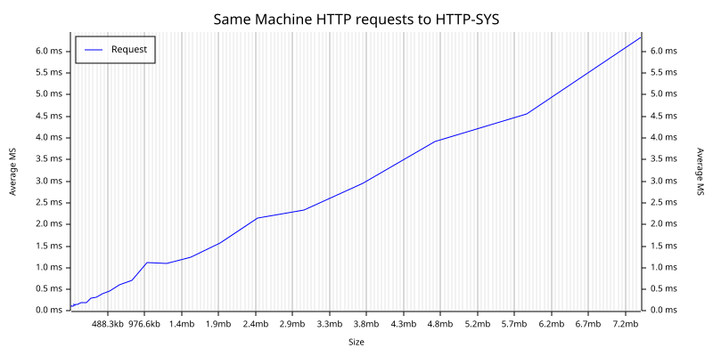

# Rust http-sys tester

A network benchmarking utility built on top of a small async wrapper around
the Windows [`http.sys`] kernel HTTP server.

The repo is a Cargo workspace with two crates:

- [`crates/httpsys`](crates/httpsys) — reusable async `http.sys` library
  (server, request/response types, IOCP plumbing).
- [`.`](src) — `test-httpsys` binary, a benchmarking driver that uses the
  library and can also run as a client / latency tester.

[`http.sys`]: https://learn.microsoft.com/en-us/windows/win32/http/http-server-api-overview

## The `httpsys` library crate

Async, IOCP-backed Windows `http.sys` server with a typed handler API.

```rust
use httpsys::{Response, ServerBuilder};

fn main() -> httpsys::Result<()> {
    let mut builder = ServerBuilder::new()?;
    builder.route("http://+:8080/api/", |_req| async {
        Response::ok_text("hello")
    })?;
    let mut server = builder.run();
    // ... do other work ...
    server.shutdown();
    server.join();
    Ok(())
}
```

Highlights:

- **`Handler` trait** with `async fn` (AFIT) and a blanket impl for closures
  returning `impl Future<Output = Response>`.
- **Concurrent receivers** — by default `available_parallelism()` outstanding
  `HttpReceiveHttpRequest` calls are kept posted against the queue. Handler
  concurrency is bounded by a `tokio::sync::Semaphore`
  (`ServerConfig::max_in_flight`, default 1024).
- **Cancellation-safe overlapped I/O** — every async op owns an
  `OverlappedWrap` whose strong reference is leaked into the kernel and
  reclaimed by the IOCP callback. Dropping a future calls `CancelIoEx` and
  blocks until the callback fires, so the buffer is never aliased.
- **Lock-free wakeups** via `atomic-waker` on the hot path.
- **Body reading** via `Request::body()` / `Request::read_body_chunk()`
  (wraps `HttpReceiveRequestEntityBody`, async).
- **`Response` builder** with `Bytes` body, `ok_text`, `ok_json`, custom
  status, and a `status` module of common codes.
- **Graceful shutdown** — `Server::shutdown()` calls
  `HttpShutdownRequestQueue`, drains in-flight handlers up to
  `ServerConfig::shutdown_timeout` (default 30 s), then `abort_all` on
  timeout. `Drop` triggers shutdown automatically.

## The `test-httpsys` binary

### Usage
`test-httpsys.exe <MODE> [OPTIONS] [RECEIVE_URL | SEND_URL] [PROXY_URL]`

### Mode commands

- **`server <RECEIVE_URL>`** — start the HTTP server. Exposes `/test`
  (returns `OK`) and `/kill` (graceful shutdown).
- **`client <SEND_URL> [PROXY_URL]`** — send requests and measure latency.
- **`echo <SEND_URL> [PROXY_URL]`** — send one request and print the body.
- **`test`** — spawn this binary as a server and sweep payload sizes
  1 KiB → ~8 MiB, writing `request-latency.svg`.

### Options

- `-n, --no-validate-certs` — accept invalid TLS certs (dev/testing only).
- `-h, --help`, `-V, --version`

## Examples

```ps
test-httpsys test                                          # self-contained sweep
test-httpsys c https://google.com/                         # client mode
test-httpsys c https://google.com/ http://localhost:8080   # via proxy
test-httpsys s http://localhost:8080                       # server mode
```

The server listens on `[receive_url]/test/`, so

```ps
test-httpsys s http://localhost:8080
```

handles requests at `http://localhost:8080/test/`. Drive it with

```ps
test-httpsys c http://localhost:8080/test/
```

You can also invoke through cargo:

```ps
cargo run -- c https://google.com
# Client sending to https://google.com/
# Average latency: 183.582809ms
```

Test-mode chart:



## Testing

```ps
cargo test                # unit + CLI integration tests across the workspace
cargo test -- --ignored   # also run the http.sys-bound smoke test (needs admin or URL ACL)
```

The ignored test binds `http://localhost:1919/nop/`. To run it without
elevation, register a one-time ACL for your user:

```ps
netsh http add urlacl url=http://+:1919/nop/ user=Everyone
```

### Loom model-checking

The `OverlappedWrap` completion handshake (Release store on `completed`,
Acquire load before reading `err`/`len`) has loom tests:

```ps
$env:RUSTFLAGS = "--cfg loom"
cargo test -p httpsys --test loom --release -- --test-threads=1
Remove-Item Env:\RUSTFLAGS
```

## Benchmarking

Microbenches (payload generation, latency-stability stats) via `criterion`:

```ps
cargo bench
# HTML reports land in target/criterion/report/index.html
```

End-to-end ad-hoc bench (spawns the binary as a server, sweeps payload sizes
1 KiB → 8 MiB, writes `request-latency.svg`):

```ps
cargo run --release -- test
```

For real load testing against a running server, drive it externally. Start
the server in one shell, then in another:

```ps
# Throughput + p50/p95/p99 latency under concurrency
bombardier -c 100 -d 30s http://localhost:8080/test/

# Or with wrk
wrk -t8 -c100 -d30s http://localhost:8080/test/
```
