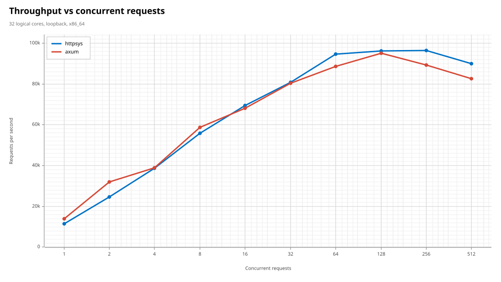
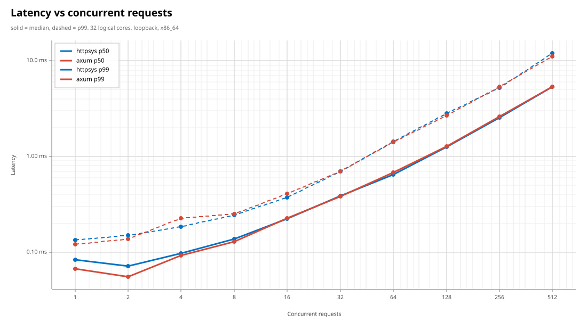
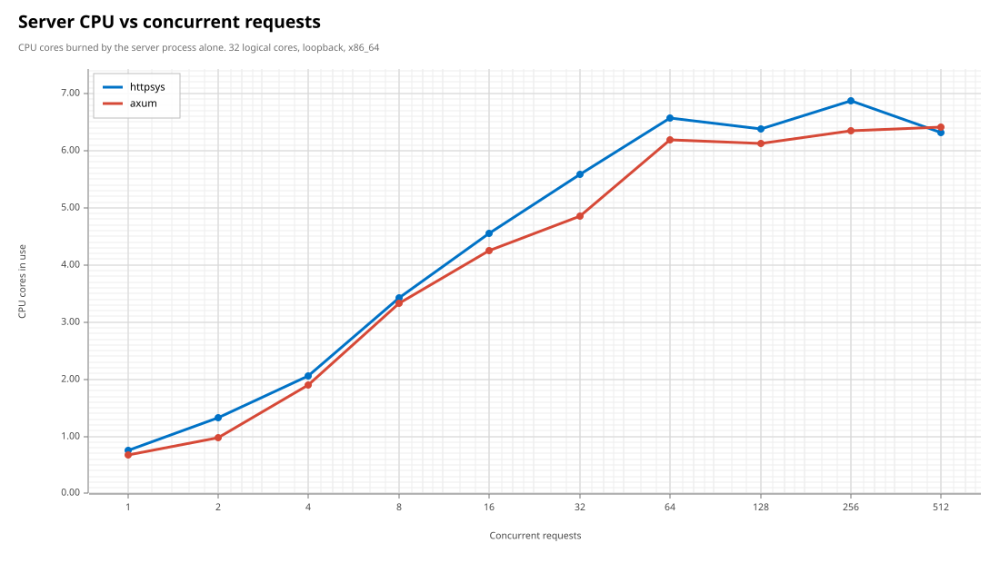
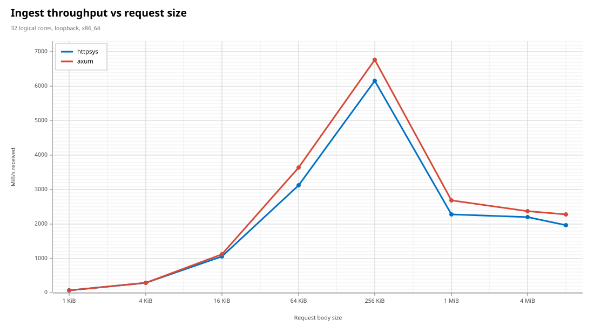
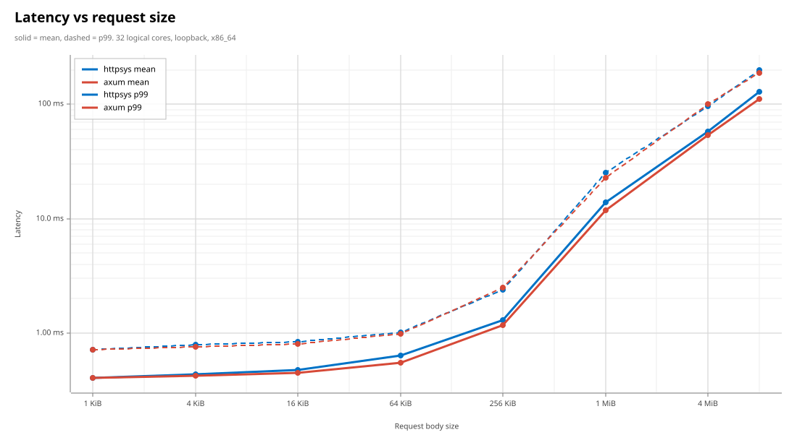
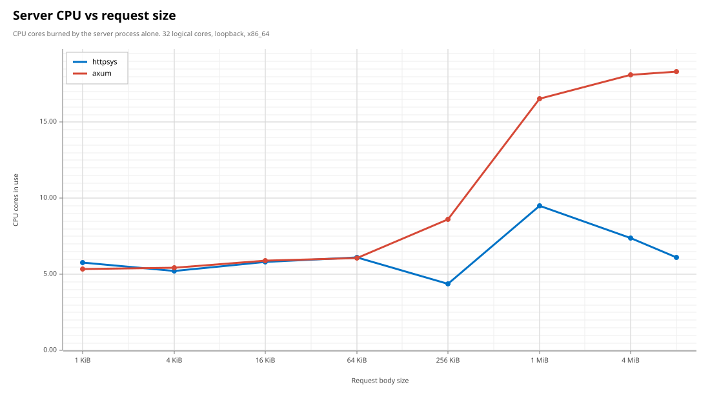

# rust-http-sys

An async Rust server built directly on the Windows [`http.sys`] kernel HTTP
stack, plus a benchmark harness that measures it head-to-head against
[`axum`].

[`http.sys`]: https://learn.microsoft.com/en-us/windows/win32/http/http-server-api-overview
[`axum`]: https://github.com/tokio-rs/axum

```
crates/httpsys/    the library: server, request/response types, IOCP plumbing
tools/httpbench/   the harness: both servers, load generator, charts
```

## The `httpsys` crate

```rust
use httpsys::{Request, Response, ServerBuilder, status};

fn main() -> httpsys::Result<()> {
    let mut builder = ServerBuilder::new()?;
    builder.route("http://+:8080/api/", |request: Request| async move {
        match request.body().await {
            Ok(body) => Response::ok_text(format!("{} bytes", body.len())),
            Err(_) => Response::new(status::BAD_REQUEST),
        }
    })?;

    let mut server = builder.run();
    // ... do other work ...
    server.shutdown();
    server.join();
    Ok(())
}
```

### What it does

- **`Handler` trait** using `async fn` in traits, with a blanket impl for
  closures returning `impl Future<Output = Response>`.
- **`Request`** with cooked accessors that borrow straight out of the
  kernel-filled receive buffer — `method()`, `url()`, known headers, and a
  `body()` that returns a `Body` borrowing that same buffer whenever the body
  arrived with the headers, which is the usual case.
- **`Response`** builder over `bytes::Bytes`, with custom headers and an
  opt-in http.sys kernel response cache.
- **Graceful shutdown** that stops the queue, drains in-flight handlers up to
  `ServerConfig::shutdown_timeout`, then aborts. `Drop` does it for you.

### How it goes fast

Each of these is a deliberate choice, and each one is measurable:

| Technique | What it replaces |
| --- | --- |
| A dedicated IOCP drained in batches with `GetQueuedCompletionStatusEx` | `BindIoCompletionCallback`, which pays a Win32 thread-pool dispatch per completion |
| `FILE_SKIP_COMPLETION_PORT_ON_SUCCESS` on the queue handle | An IOCP round trip for every receive http.sys could satisfy inline |
| `HTTP_RECEIVE_REQUEST_FLAG_COPY_BODY`, adaptively | A second syscall to fetch the body of every request that has one |
| Receive buffers that resize to the traffic each slot sees | A fixed 16 KiB buffer that forces uploads down the streaming path forever |
| `HTTP_RECEIVE_REQUEST_ENTITY_BODY_FLAG_FILL_BUFFER` | One syscall per partially-filled body chunk |
| Pooled receive buffers, body buffers and `OVERLAPPED` state | A heap allocation per request, per body and per response |
| A fixed set of request slots, each owning a request end to end | A `tokio::spawn` and a semaphore acquire per request |

The safety story is uniform: every async operation owns an `OVERLAPPED` whose
strong reference is handed to the kernel and reclaimed exactly once — by a
completion thread, or by the submitting task when the kernel completes inline
or refuses the call. Dropping a future before completion issues `CancelIoEx`
and blocks until the completion fires, so the kernel never writes into a
buffer Rust has already reused.

### Tuning

`ServerConfig` defaults suit a general-purpose server. Two knobs matter for
upload-heavy work:

- `request_buffer_bytes` (16 KiB) — the initial receive buffer. Anything that
  fits, headers and body together, arrives in a single syscall.
- `max_request_buffer_bytes` (128 KiB) — how far a slot's buffer may grow when
  it keeps seeing larger bodies. Raising it trades memory for syscalls.

## The `httpbench` tool

```ps
cargo build --release

# Full sweep against both engines, writes SVG charts + results.csv
.\target\release\httpbench.exe bench --out charts

# Run one server
.\target\release\httpbench.exe serve --engine httpsys --port 8080

# Drive a running server
.\target\release\httpbench.exe load --port 8080 -c 64 -d 10s -s 64KiB
```

`bench` spawns each engine as a child process, drives it with a closed-loop
HTTP/1.1 load generator built on raw hyper connections, and brackets every
measured window with `GetProcessTimes` snapshots of the *server* process — so
the CPU numbers exclude the load generator entirely.

Both servers expose the same endpoint and do the same work per request: read
the whole request body, reply `200 OK` with a two-byte `text/plain` body.
`TCP_NODELAY` is set on both sides.

### URL reservations

http.sys requires a URL reservation. Either grant one once, as administrator:

```ps
netsh http add urlacl url=http://+:8080/ user=Everyone
netsh http add urlacl url=http://+:8081/ user=Everyone
```

…or reuse the reservation Windows already grants to `\Everyone`, which needs
no elevation at all:

```ps
.\target\release\httpbench.exe bench `
    --ports 80,8081 --path /Temporary_Listen_Addresses/bench/
```

## Results

32 logical cores, loopback, `--duration 4 --warmup 1`. Numbers move a few
percent run to run; the shapes are stable. Raw per-point data is in
[charts/results.csv](charts/results.csv).

| | httpsys | axum | |
| --- | ---: | ---: | --- |
| Peak throughput, small requests | **96.4k req/s** | 95.1k req/s | |
| Throughput at 256 connections | **96.4k req/s** | 89.3k req/s | httpsys holds its peak |
| Median latency at 1 connection | 84 µs | **67 µs** | axum wins when idle |
| Ingest at 256 KiB bodies | 6167 MiB/s | **6770 MiB/s** | |
| Ingest at 8 MiB bodies | 1973 MiB/s | **2278 MiB/s** | |
| Server CPU at 8 MiB bodies | **6.10 cores** | 18.32 cores | 2.6x more efficient per byte |








Reading them honestly:

- **Many small requests — httpsys wins, and holds on longer.** Peak throughput
  is only a nose ahead, but the useful difference is at the top of the curve:
  httpsys is still at its peak with 256 connections in flight, where axum has
  already given up 6%.
- **Low concurrency — axum wins.** With a handful of connections in flight, a
  plain socket read beats a kernel-mode request queue on raw latency. There is
  per-request bookkeeping inside http.sys that a userspace parser simply does
  not do.
- **Ingest throughput — axum wins by about 10%.** This one is structural: a
  socket read copies bytes from the TCP buffer straight into user memory,
  while http.sys buffers the entity body in kernel pool first and copies from
  there. That extra hop is not something a user-mode wrapper can remove, and
  six rounds of optimisation only narrowed it from 2.7x to 1.1x.
- **CPU on large uploads — httpsys wins outright, by a lot.** At 8 MiB bodies
  it delivers 87% of axum's throughput for **33% of the CPU**, because http.sys
  does the framing and buffering in the kernel instead of running a parser over
  every byte in user space.

The short version: if you are serving many small requests, or you care what
large uploads cost you in CPU, http.sys is the better substrate. If you want
the last 10% of raw upload bandwidth on a single box, a socket is.

### The kernel response cache

`Response::cache_in_kernel_for_secs` lets http.sys answer repeat requests from
kernel mode without ever waking your handler. It is deliberately **not** used
in the comparison above, because axum has no equivalent and the result would
not mean anything. Try it with:

```ps
.\target\release\httpbench.exe serve --engine httpsys --kernel-cache
```

## Testing

```ps
cargo test --workspace          # unit tests, no http.sys required
cargo test -p httpsys --test server --release -- --ignored --test-threads=1
```

The `--ignored` set binds a real http.sys queue under
`http://+:80/Temporary_Listen_Addresses/`, so it needs no elevation and no
setup — only a free port 80. It covers routing, verbs, inline bodies, a 1 MiB
streamed body verified by checksum, oversized headers, and graceful shutdown.

### Loom

The `OverlappedWrap` completion handshake is model-checked:

```ps
$env:RUSTFLAGS = "--cfg loom"
cargo test -p httpsys --test loom --release -- --test-threads=1
Remove-Item Env:\RUSTFLAGS
```

## License

MIT OR Apache-2.0.
